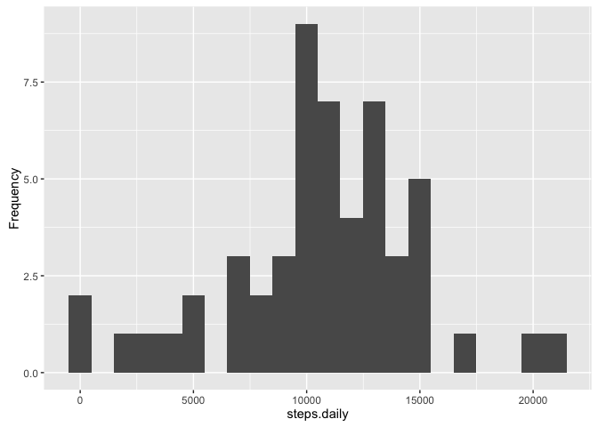
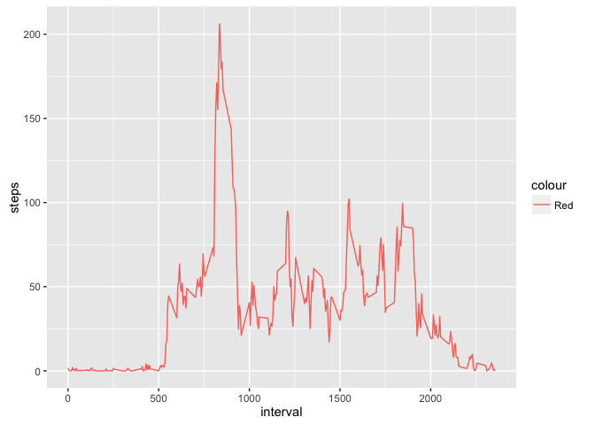
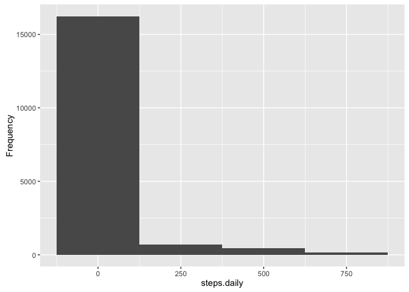
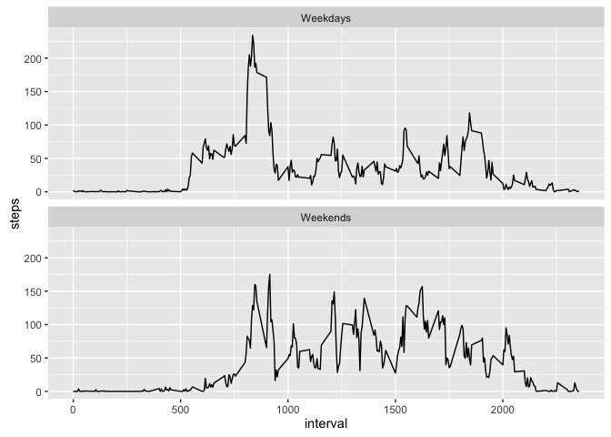

# Reproducible Research: Peer Assessment 1


## Loading and preprocessing the data

```r
require(dplyr)
```

```
## Loading required package: dplyr
```

```
## 
## Attaching package: 'dplyr'
```

```
## The following objects are masked from 'package:stats':
## 
##     filter, lag
```

```
## The following objects are masked from 'package:base':
## 
##     intersect, setdiff, setequal, union
```

```r
file_url <- "activity.zip"
temp_file_name <- basename(file_url)
#download.file(file_url,temp_file_name)
my.csv.file <- unzip(temp_file_name) %>% read.csv(stringsAsFactors = F) %>% mutate(date = as.POSIXct(date, format="%Y-%m-%d"))
#file.remove(temp_file_name)
head(my.csv.file,15)
```

```
##    steps       date interval
## 1     NA 2012-10-01        0
## 2     NA 2012-10-01        5
## 3     NA 2012-10-01       10
## 4     NA 2012-10-01       15
## 5     NA 2012-10-01       20
## 6     NA 2012-10-01       25
## 7     NA 2012-10-01       30
## 8     NA 2012-10-01       35
## 9     NA 2012-10-01       40
## 10    NA 2012-10-01       45
## 11    NA 2012-10-01       50
## 12    NA 2012-10-01       55
## 13    NA 2012-10-01      100
## 14    NA 2012-10-01      105
## 15    NA 2012-10-01      110
```

## What is mean total number of steps taken per day?


```r
total.steps.daily <- filter(my.csv.file,!is.na(steps)) %>%
  group_by(date) %>% summarize(steps = sum(steps)) %>%
  print
```

```
## # A tibble: 53 <U+00D7> 2
##          date steps
##        <dttm> <int>
## 1  2012-10-02   126
## 2  2012-10-03 11352
## 3  2012-10-04 12116
## 4  2012-10-05 13294
## 5  2012-10-06 15420
## 6  2012-10-07 11015
## 7  2012-10-09 12811
## 8  2012-10-10  9900
## 9  2012-10-11 10304
## 10 2012-10-12 17382
## # ... with 43 more rows
```

## What is the average daily activity pattern?

```r
 require(ggplot2)
```

```
## Loading required package: ggplot2
```

```r
ggplot(data = total.steps.daily,aes(steps)) +
        geom_histogram(binwidth = 999) +
        labs(x = "steps.daily",y="Frequency")
```

<!-- -->
## Means and Medians of daily steps 

```r
mean.median.total.steps.daily <- filter(my.csv.file,!is.na(steps)) %>%
  group_by(date) %>% summarize(mean.daily.steps = mean(steps),
                               median.daily.steps = median(steps)) %>%
                               
  print
```

```
## # A tibble: 53 <U+00D7> 3
##          date mean.daily.steps median.daily.steps
##        <dttm>            <dbl>              <dbl>
## 1  2012-10-02          0.43750                  0
## 2  2012-10-03         39.41667                  0
## 3  2012-10-04         42.06944                  0
## 4  2012-10-05         46.15972                  0
## 5  2012-10-06         53.54167                  0
## 6  2012-10-07         38.24653                  0
## 7  2012-10-09         44.48264                  0
## 8  2012-10-10         34.37500                  0
## 9  2012-10-11         35.77778                  0
## 10 2012-10-12         60.35417                  0
## # ... with 43 more rows
```
## Time series plot of the average number of steps taken

```r
avg.step <- filter(my.csv.file,!is.na(steps)) %>%
  group_by(interval) %>% summarise(steps = mean(steps))
ggplot(avg.step, aes(interval,steps, col= "Red")) + geom_line() 
```

<!-- -->
## The 5-minute interval that, on average, contains the maximum number of steps

```r
  avg.step[which.max(avg.step$steps),]
```

```
## # A tibble: 1 <U+00D7> 2
##   interval    steps
##      <int>    <dbl>
## 1      835 206.1698
```
## Imputing missing values

```r
require(mice)
```

```
## Loading required package: mice
```

```
## Loading required package: Rcpp
```

```
## mice 2.25 2015-11-09
```

```r
temp_data <- select(my.csv.file,interval,steps) %>%mice(method="sample") %>% complete()
```

```
## 
##  iter imp variable
##   1   1  steps
##   1   2  steps
##   1   3  steps
##   1   4  steps
##   1   5  steps
##   2   1  steps
##   2   2  steps
##   2   3  steps
##   2   4  steps
##   2   5  steps
##   3   1  steps
##   3   2  steps
##   3   3  steps
##   3   4  steps
##   3   5  steps
##   4   1  steps
##   4   2  steps
##   4   3  steps
##   4   4  steps
##   4   5  steps
##   5   1  steps
##   5   2  steps
##   5   3  steps
##   5   4  steps
##   5   5  steps
```

```r
date <- my.csv.file$date
my.csv.file.updated <- mutate(temp_data,date = date)
```

## Histogram of the total number of steps taken each day after missing values are imputed

```r
ggplot(data = my.csv.file.updated,aes(steps)) +
        geom_histogram(binwidth = 250) +
        labs(x = "steps.daily",y="Frequency")
```

<!-- -->
## Mean and median after missing values are inserted 


```r
mean.median.total.steps.daily.complete <- group_by(my.csv.file.updated,date) %>% summarize(mean.daily.steps = mean(steps),
                               median.daily.steps = median(steps)) %>%
                print               
```

```
## # A tibble: 61 <U+00D7> 3
##          date mean.daily.steps median.daily.steps
##        <dttm>            <dbl>              <dbl>
## 1  2012-10-01         39.55208                  0
## 2  2012-10-02          0.43750                  0
## 3  2012-10-03         39.41667                  0
## 4  2012-10-04         42.06944                  0
## 5  2012-10-05         46.15972                  0
## 6  2012-10-06         53.54167                  0
## 7  2012-10-07         38.24653                  0
## 8  2012-10-08         23.20486                  0
## 9  2012-10-09         44.48264                  0
## 10 2012-10-10         34.37500                  0
## # ... with 51 more rows
```

## Panel plot comparing the average number of steps taken per 5-minute interval across weekdays and weekends

```r
week.ends <- c("Saturday","Sunday")
date.factor <- ifelse(weekdays(my.csv.file$date) %in% week.ends,"Weekends","Weekdays")
data.with.date.factor <- mutate(my.csv.file,date.factor = as.factor(date.factor))
mean.steps.daily <- filter(data.with.date.factor,!is.na(steps)) %>%
group_by(date.factor,interval) %>% summarize(steps = mean(steps)) 

ggplot(mean.steps.daily, aes(interval,steps)) + geom_line() + facet_wrap(~date.factor,nrow = 2,ncol = 1) 
```

<!-- -->

## Are there differences in activity patterns between weekdays and weekends?
### Yes, the weekdays had more activities than the weekends
